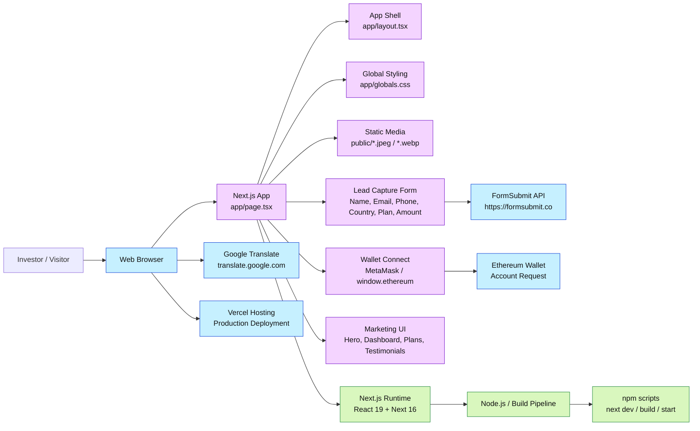

# Architecture Overview

This repository is a single-page Next.js marketing and lead-capture application for the Grayscale Investment Platform. It renders a crypto investment landing page, handles wallet connection and form submission, and integrates with external services for translation and email delivery.

## Key architectural observations

- Frontend: Next.js App Router application with a single interactive landing page in `app/page.tsx`.
- Presentation layer: dark crypto-themed UI with marketing content, performance stats, pricing cards, and success modal states.
- Lead capture: form submission posts investor data to FormSubmit for email handling.
- Wallet interaction: optional MetaMask/Ethereum wallet connection for investor onboarding.
- Translation: Google Translate embed is enabled via the browser script and language selector.
- Hosting: repository is configured for Vercel deployment and serves static assets from `public/`.

## Main files

- `app/page.tsx` — primary application logic and UI
- `app/layout.tsx` — application layout shell
- `app/globals.css` — global styling
- `public/` — local image assets
- `next.config.ts` — Next.js configuration
- `package.json` — dependencies and scripts
